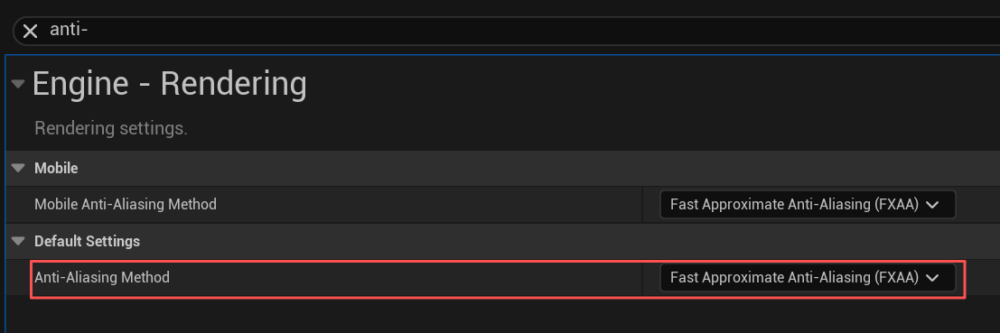

# Third-Person Seamless Portal

**Portal** as a game mechanic was well developed and applied more than a decade ago. However, as a classic **visual trick**, its unique charm still does not feel outdated today. To achieve a smooth, natural teleportation process, many interesting details must be considered. Before explaining the implementation principles in detail, let's first look at the final effect.


# Basic Principle

When discussing a pair of portals, for ease of description we define a default order: the player always enters portal A and is teleported to portal B. We call **portal A** the **trigger portal**, and **portal B** the **linked portal**.

To implement the above visual effect, we break it down into three stages for explanation.

## Image Capture

We first place a plane inside the portal and display in real time the image of the other portal's location. This requires using the **RenderTarget** mechanism.

**RenderTarget** is a texture that can be rendered to, used to store the rendering result of a camera. In this example, we use **SceneCaptureComponent2D** as a virtual camera, storing its captured view into the RenderTarget. The material can then sample that RenderTarget as a regular texture, thereby displaying the captured view in real time.


- When not active, it simply displays white; when active, it reads the texture.

**Key question: Where to place the virtual camera?** The key question is: where should the virtual camera be placed so that it captures an image that matches the player's **perceptual intuition**? As shown (this is a top-down view), we define the red arrow as the portal's **forward direction (ForwardVector)**. Portal A and B are a linked pair. When the player stands to the right of portal A and looks into the portal, the image they should see is provided by portal B's virtual camera, and its content should correspond to the area **to the left of portal B**. *(This is intuitive: because after the player teleports from A to B, they will appear on the left side of B, facing B's forward direction, ready to traverse again.)*


**Transformation logic:**

The transform of the player's camera in world space relative to the **trigger portal** A, after a mirrored rotation (rotated 180 degrees around A's up axis), becomes the transform of the linked portal B's virtual camera relative to portal B. *(The virtual camera's pitch and roll remain the same relative to the player's camera.)*


It might be more intuitive in the editor. Note that the rule is consistent for both portal A and portal B. We can see the blue portal B whose virtual camera is in a “strange” position, but with careful thought it's reasonable. Although we haven't discussed the rotation relationship in detail, the virtual camera orientation still follows the above rule for transformation. Let's restate this transformation again: **For any portal, the virtual camera's position relative to that portal equals the player's camera position relative to its linked portal, rotated 180 degrees around the linked portal's up axis.**


Using Unreal Engine's math tools, we can quickly write this code.

```
FTransform APortalDoor::CalculateMirroredRelativeTrans(const FTransform& InTransform, 
const FTransform& BaseTransform)
{
	// get relavatie transform
	FTransform LocalTrans = InTransform.GetRelativeTransform(BaseTransform);
	const FVector UpVector = BaseTransform.GetRotation().GetUpVector();
	
	// make rotation matrix, around upvector rotate 180'
	FQuat RotUp180Quat(UpVector, FMath::DegreesToRadians(180.0f));
	FTransform  FMirroredLocalTrans;
	FMirroredLocalTrans.SetLocation(RotUp180Quat.RotateVector(LocalTrans.GetLocation()));
	FMirroredLocalTrans.SetRotation(RotUp180Quat * LocalTrans.GetRotation());

	// now we get mirrored transform
	return FMirroredLocalTrans;
}
```

Both parameters of this function are world transforms. `InTransform` is the transform of the object we want to rotate 180 degrees (in this example we pass the `CameraManager` transform), and `BaseTransform` is the reference transform (in this example we pass the transform of the **linked portal**). The function's return value is the mirrored **relative transform**, which can be directly assigned to the `SceneCaptureComponent2D` component of the portal itself.

**Reason for choosing `BaseTransform`:**

The image shown by portal A (the trigger portal) is captured by the virtual camera at portal B (the linked portal). Therefore, for portal A, the base used when mirroring the player's camera transform is the linked portal B's transform, and the resulting relative transform is used to set portal A's `SceneCaptureComponent2D` component. The logic is the same for portal B.

```
// tick update 
void APortalDoor::Tick(float deltaTi)
{

	APortalDoor* LinkDoor = GetLinkPortal();
	APlayerCameraManager* CameraManager = UGameplayStatics::GetPlayerCameraManager(this,0);
	FTransform CameraTransform = CameraManager->GetTransform();
	FTransform  FMirroredLocalTrans = CalculateMirroredRelativeTrans(CameraTransform,LinkDoor->GetActorTransform());
	
	// PortalCamera is SceneCaptureComponent2D
	PortalCamera->SetRelativeTransform(FMirroredLocalTrans);
	
}
```

This transformation relation is one of the core mathematical calculations in this gameplay design; we name it the **mirrored transform**. In later sections, whenever this name is mentioned, it indicates the same data calculation was performed, possibly only with different input parameters.

## Camera Handling

Now that we have implemented a mechanism that correctly displays the world behind the portal, should we analyze the secrets of the teleport process? Not yet — before that, let's assume the teleport mechanism is functioning correctly (detailed explanation will be given in the next section) and first discuss the camera handling details.

**Problem statement:**

Consider this: in a third-person game, when the character is teleported, the player's camera follows the character and the scene changes instantly. This sudden viewpoint jump will **strongly remind** the player that the character's position has changed. How can we eliminate this revealing camera cut? Our approach is to perform two **ViewTarget** switches.

We add an extra normal **CameraComponent** to the portal (distinct from the `SceneCaptureComponent2D`), hereafter called the **ViewCamera**. It will take over the player's camera before and after teleportation to present the view. Its behavior pattern is as follows:

| Switch Stage                              | Behavior Description                                         |
| ----------------------------------------- | ------------------------------------------------------------ |
| First switch (before entering)            | When the character is crossing the portal but teleportation hasn't occurred, `ViewCamera` fully mimics the player camera's position and rotation. At this time call `DetachViewTarget(true)` and the `PlayerController` switches view target from character to **look at the portal**. |
| Before the second switch (after teleport) | After the character crosses and teleportation occurs, the `ViewCamera` position will **mirror-mimic** the player camera's relative transform to the linked portal (**apply the mirrored transform a second time**), creating the illusion that the character still stays behind the portal. |
| Second switch (after leaving)             | When the camera also passes through the portal, call `DetachViewTarget(false)` and the `PlayerController` switches back to **look at the character**. The teleport process ends. |

```
// Update ViewCamera transform, used before the second switch
void APortalDoor::UpdateViewCameraTransform()
{
	APortalDoor* LinkDoor = GetLinkPortal();
	if (!LinkDoor)
	{
		return;
	}
	
	ACharacter* Character = Cast<ARCharacter>(UGameplayStatics::GetPlayerCharacter(this,0));
	auto CharacterCam = Character ->GetCharacterCamera();
	FTransform PlayerCameraTrans = CharacterCam->GetComponentTransform();
	FTransform  FMirroredLocalTrans = CalculateMirroredRelativeTrans(PlayerCameraTrans,LinkDoor->GetActorTransform());

	ViewCamera->SetWorldTransform(FMirroredLocalTrans * GetActorTransform());
}

void APortalDoor::DetachViewTarget(const bool bDetach)
{
	APlayerController* PlayerController = UGameplayStatics::GetPlayerController(this,0);
	if (bDetach)
	{
		PlayerController->SetViewTargetWithBlend(this,0);
	}else
	{

		ACharacter* Character =UGameplayStatics::GetPlayerCharacter(this,0);
		PlayerController->SetViewTargetWithBlend(Character,0);
	}
}
```

**Raycast check to prevent revealing**

To avoid the player rotating the camera during the view detachment and seeing an empty scene behind the portal, we continuously perform **raycasts** during this process: cast a ray from the character camera toward the character, and once the ray no longer hits the portal (i.e., we consider the character to have moved behind the portal), we immediately end the view detachment state.

## Teleport Handling

When the character crosses a portal, they must be teleported to the corresponding position behind the linked portal. The target position calculation still uses the **mirrored transform** described above. Simply replace `InTransform` in `CalculateMirroredRelativeTrans` with the **character's own** transform, and replace `BaseTransform` with the **trigger portal** transform.

```
void APortalDoor::TeleportCharacter(ACharacter* Character)
{
		FTransform CharacterTransform = Character->GetActorTransform();
		FTransform  FMirroredLocalTrans = CalculateMirroredRelativeTrans(CharacterTransform,GetActorTransform());
		FTransform FinalTransform = FMirroredLocalTrans * GetLinkPortal()->GetTransform();
		
		Character->SetActorLocation(FinalTransform.GetLocation());
		Character->SetActorRotation(FinalTransform.Rotator());
}
```

Not done yet! To maintain **continuity** after teleportation, we also need to reset the character's **velocity vector** and the **PlayerController** orientation.

### Velocity Direction Handling

For the velocity vector, the **spatial attitude relationship** of the velocity vector relative to the character's own directional vectors should be preserved before and after teleportation. In other words, the angle, relative direction, and magnitude relationship of these two vectors should not change because of the teleport.

Assume:

- $R_{old}$: the character's rotation matrix before teleport
- $R_{new}$: the character's rotation matrix after teleport
- $V_{old}$: the velocity vector before teleport
- $V_{new}$: the desired new velocity vector after teleport

The goal is to keep the relative direction consistent, i.e.:

$$
V_{new} = R_{new}*R^{-1}_{old} * V_{old}
$$


In Unreal Engine, we use the pair of math tools `UnrotateVector` and `RotateVector` to describe this.

- `RotateVector(v)` : $R*v$
- `UnrotateVector(v)` : $R^{-1}*v$

| Function            | Purpose                                                | Meaning         |
| ------------------- | ------------------------------------------------------ | --------------- |
| `RotateVector(v)`   | Rotate a vector from local to world space              | apply rotation  |
| `UnrotateVector(v)` | Inverse-rotate a vector from world back to local space | remove rotation |

They are inverse operations. Based on this, we can quickly write the following code:

```
FVector OldCharacterDir =  Character->GetActorForwardVector();
FRotator OldVelocity = Character->GetVelocity().Rotation();

// after Teleport...
FVector NewCharacterDir = Character->GetActorForwardVector();

FVector LocalVelocityVec = OldVelocityDir.UnrotateVector(OldCharacterDir);
FVector NewVelocity = (LocalVelocityVec.Rotation()).RotateVector(NewCharacterDir);

// set new direction
Character->GetCharacterMovement()->Velocity = FinalVelocityDir;
```

### `PlayerController` Handling

For the `PlayerController`, more details must be considered.

When teleport occurs, the character's rotation has been changed. If the `PlayerController` rotation is not updated synchronously, the player might end up looking at the character's back before teleport and then watching the character's side after teleport. Also, the `PlayerController` rotation affects the player's camera position. The solution is simple: similar to the velocity handling, we only need to ensure the `PlayerController` orientation preserves the **relative relationship** with the character orientation before and after teleport. The only subtle difference is that we **only modify** the `Yaw` component of the `PlayerController`.

```
FVector OldCharacterDir =  Character->GetActorForwardVector();
FRotator ControllerRot =  PlayerController->GetControlRotation();

// after Teleport...
FVector NewCharacterDir = Character->GetActorForwardVector();

	FVector LocalControllerVec  =  ControllerRot.UnrotateVector(OldCharacterDir);
FVector FinalControlDir = (LocalControllerVec.Rotation()).RotateVector(NewCharacterDir);
ControllerRot.Yaw = FinalControlDir.Rotation().Yaw;

// set new direction
PlayerController->SetControlRotation(ControllerRot);
```

**Fixing control mismatch**

Another important issue about the PlayerController is: because the `PlayerController` rotation has been modified, but the player's actual viewed world direction did not change, this causes its orientation to be inconsistent with the player's viewing direction. The resulting problem is that when the player looks through the portal and tries to control the character to move forward, the character may actually move sideways. The solution is to ensure that in the character's control input functions, the character's movement direction **always follows the PlayerController's direction**, thereby eliminating this mismatch between control and movement and making the result conform perfectly to the player's intuitive operation.

```
void YourCharacter::Input_Move(const FInputActionValue& InputValue)
{
	if (!Controller) { return; }
	
	const FVector2D Value = InputValue.Get<FVector2D>();
	const FRotator Rotation = Controller->GetControlRotation();
	
	// error!!!
	// APlayerCameraManager* CameraManager = UGameplayStatics::GetPlayerCameraManager(this,0);
	// FRotator Rotation = CameraManager->GetCameraRotation();
	
	const FRotator YawRotation(0.0f, Rotation.Yaw, 0.0f);
	
	if (Value.X != 0.0f)
	{
		const FVector Direction = YawRotation.RotateVector(FVector::RightVector);
		AddMovementInput(Direction, Value.X);
	}

	if (Value.Y != 0.0f)
	{
		const FVector Direction = YawRotation.RotateVector(FVector::ForwardVector);
		AddMovementInput(Direction, Value.Y);
	}
}
```

This is a very typical movement function, and the input component used is Unreal Engine's Enhanced Input Component. If you're interested, you can look up related articles yourself, but that's beyond the scope of this article. The logic expressed by this code is very simple: accept input and convert it into direction vectors to drive the movement component. We must ensure the `YawRotation` used is **based on the Controller's orientation**, not the commented-out `CameraManager` code. Although in a normal third-person view they might be equivalent, in our special portal scenario using `CameraManager` will cause control and movement mismatches.

Finally! Once we handle all these mathematical relationships correctly, we can achieve a very smooth and natural third-person portal, except for the last set of details.

## Detail Handling

**Mirrored Character**

When a character only partially passes through a portal, the character model can be visually cut in half by the portal.


The example uses a **simple and clever** method: while the character has passed through portal A but teleportation has not yet been triggered, we spawn an identical **mirrored character** at portal B (the linked portal). This mirrored character fully mimics the player-controlled character's animations and undergoes the **mirrored transform** to simulate the character's movement at A, matching the image projected from portal B.

```
	APortalDoor* LinkDoor = GetLinkPortal();
	auto* Character = UGameplayStatics::GetPlayerCharacter(this,0);
	FTransform CharacterTransform = Character->GetActorTransform();
	FTransform  FMirroredLocalTrans = CalculateMirroredRelativeTrans(CharacterTransform,LinkDoor->GetActorTransform());
	MirrorCharacter->SetActorTransform(FMirroredLocalTrans * GetActorTransform());
```

Creating a character that mimics animations is also easy: Unreal Engine provides an animation blueprint node `CopyPoseFromMesh`. As shown in the figure:


Here `CharacterReference` is the player-controlled character's MeshComponent. We only show the mirrored character at the linked portal while the player is in the portal region but not yet teleported. Sometimes the first frame may show a T-Pose because the bone pose data hasn't been prepared; we need to manually update it.

```
MirrorCharacter->GetMesh()->RefreshBoneTransforms();
MirrorCharacter->SetActorHiddenInGame(false);
```

After doing all this, the effect is as shown below: the image projected from the linked portal matches the player character who is passing through the portal perfectly. It fits seamlessly. Although with careful observation you can still see seams where the portal cuts through, the detail is already good enough to fool the player's eye.


# Project Implementation

The previous chapter has analyzed the entire composition principle of the visual trick; there are no more technical secrets. This section will explain the sample project's implementation. There are pros and cons in project implementations, but there is no single correct answer. This sample project is intended to better demonstrate the full scope of the gameplay; it skips many trial-and-error and modification steps and presents results that conform to personal design and code organization habits.

Therefore, I also highly encourage you to refer to the principles in the previous chapter and reproduce this gameplay in your own preferred way — this is undoubtedly the best attempt to deeply understand the mechanic!

## Flow Design

The portal Actor is shown below, using GameplayTag to identify portals and find matching linked portals.

- `ActiveDetectionBox`: used to detect whether the character enters/leaves the portal area, activate/deactivate the portal and perform a series of behaviors
- `CrossingDetectionBox`: used to detect whether the character is performing/finishing the crossing action; teleport the character when leaving the collision area
- `ViewCamera`: a CameraComponent that takes over and displays the view when the camera is detached
- `PortalCamera`: SceneCaptureComponent2D, used to capture and transmit images to the linked portal
- `Plane`: the texture captured by `PortalCamera` is displayed on this mesh material


**Why design two TriggerBoxes?**

The benefit of this design is that by the **trigger order** of `Overlap` events, we can directly distinguish the player's entering direction for the portal:

- **Correct direction entry:** Player collides with `ActiveDetectionBox` first, then collides with `CrossingDetectionBox`. When the player leaves the `CrossingDetectionBox` area, teleportation is executed.
- **Wrong direction entry:** Player collides with `CrossingDetectionBox` first, then `ActiveDetectionBox`. In this case, the player is considered to have entered from the wrong direction and teleportation is not executed.

Combined with the **state machine architecture** described next, this design saves a lot of complex conditional logic.

## State Machine Architecture

A state machine is a common solution for handling gameplay flow. Although the number of states in the example is not so large as to be chaotic, using a state machine pattern still helps greatly **reduce mental load**. For this gameplay we don't need an overly complex state machine architecture. We divide the entire teleportation process into roughly three phases; the portal **states** total six, all identified by `GameplayTag` and managed by a `StateMachineComponent` attached to the Portal.

| **State Name**            | **Owner**          | **Trigger Condition**                   | **Main Logic**                                               |
| ------------------------- | ------------------ | --------------------------------------- | ------------------------------------------------------------ |
| `Portal.UnActive`         | Portal             | Default/leave                           | Portal is inactive, only shows glowing image.                |
| `Portal.Active`           | **Trigger Portal** | Character enters `ActiveDetectionBox`   | Update `PortalCamera` transform, capture image for linked portal. |
| `Portal.LinkActive`       | **Linked Portal**  | Character enters `ActiveDetectionBox`   | Update `PortalCamera` transform, capture image for trigger portal. |
| `Portal.Crossing`         | **Trigger Portal** | Character enters `CrossingDetectionBox` | Trigger camera detachment (first switch), start updating `ViewCamera` (mimic player camera). |
| `Portal.LinkCrossing`     | **Linked Portal**  | Character enters `CrossingDetectionBox` | **Spawn mirrored character** to simulate character movement. |
| `Portal.PostCrossing`     | **Trigger Portal** | Character leaves `CrossingDetectionBox` | `ViewCamera` performs mirrored transform update (before the second switch). |
| `Portal.LinkPostCrossing` | **Linked Portal**  | Character leaves `CrossingDetectionBox` | Hide mirrored character, perform raycast checks, prepare to change `ViewTarget` (second switch). |

Basically, these states come in corresponding pairs, and the logic each state needs to focus on is very concise.

`StateMachineComponent` implementation is relatively simple: it stores state transition rules in a **DataTable** form and provides a unified interface `TryChangeState` for state switching. Additionally, it offers three key entry functions which each state instance overrides to implement their own logic:

- `OnStateEntered` when state is entered
- `OnStateExited` when state is exited
- `Update` for Tick updates

```
bool UStateMachineComponent::TryChangeState(const FGameplayTag NewStateTag)
{
	// ...
	// check can transition
	
	UStateBase* NextState = AllStates[NewStateTag];
	// Exits Old State
	FGameplayTag PreviousStateTag;
	PreviousStateTag = CurrentState->GetStateTag();
	CurrentState->OnStateExited_Implementation(NewStateTag);
    
	// Enter New State
	CurrentState = NextState;
	CurrentState->OnStateEntered_Implementation(PreviousStateTag);
	
	// ...
}
```

And the allowed transitions between states are shown in the following diagram:


## Some Other Settings

**Collision Adjustment**

When rotating the camera while the view is detached, we need to disable the player's camera `SpringArm` collision testing, so that an unexpected collision does not cause the camera position to jump and thereby cause the observation position on the trigger portal side to jump. This adjustment is simple and we put it in the `LinlPostCrossingState` logic.

```
void UPortalLinkPostCrossingState::OnStateEntered_Implementation(const FGameplayTag& FromState)
{
	Super::OnStateEntered_Implementation(FromState);

	APortalCharacter* PCharacter = Cast<APortalCharacter>(UGameplayStatics::GetPlayerCharacter(this,0));
	check(PCharacter);
	if (USpringArmComponent* SpringArm = PCharacter->GetCameraBoom())
	{
		SpringArm->bDoCollisionTest = false;
	}
	
}

void UPortalLinkPostCrossingState::OnStateExited_Implementation(const FGameplayTag& ToState)
{
	Super::OnStateExited_Implementation(ToState);
	APortalCharacter* PCharacter = Cast<APortalCharacter>(UGameplayStatics::GetPlayerCharacter(this,0));
	check(PCharacter);
	if (USpringArmComponent* SpringArm = PCharacter->GetCameraBoom())
	{
		SpringArm->bDoCollisionTest = true;
	}
}
```

**Anti-aliasing**

We changed the project's anti-aliasing settings to FXAA, which makes the images inside the portals look more natural.



**Mirrored Character**

For the mirrored character used to copy poses, we show it before crossing. It may happen that when showing it, due to visibility settings the bone pose has not yet been updated and the first frame shows an incorrect pose, especially on its first show (initial pose is T-Pose). To fix this revealing frame, you can change the following setting:


Change the optimization setting: set `VisibilityBaseAnimTickOption` to `AlwaysTickPoseAndRefreshBones`. This setting will cause the mesh to update bone positions even when hidden.

However, this is not friendly to performance. Therefore, the sample project uses the method of manually updating one frame before showing.

```
	PortalDoor->MirrorCharacter->GetMesh()->GetAnimInstance()->UpdateAnimation(0,true);
	PortalDoor->MirrorCharacter->GetMesh()->RefreshBoneTransforms();
	PortalDoor->MirrorCharacter->SetActorHiddenInGame(false);
```

It is worth mentioning that the sample did not do extensive performance optimization, so a noticeable frame rate drop may exist.

With that, there is nothing more to be explained. Once again this skips many thought steps and attempts to present the final result. In fact, we can further extend more interesting visual experiences on top of this, as *Portal* once did, but overall, for the current complexity, this document is already long enough.

# Links

Github：https://github.com/Pudding-Evan/Portal

Youtube：https://www.youtube.com/watch?v=hTbaRXJlLrI

# References

It should be stated that most of the ideas in this article have already been summarized and implemented by others. Of course, that does not prevent us from trying and creating such gameplay again — after all, that's part of the fun.

https://www.froyok.fr/blog/2019-03-creating-seamless-portals-in-unreal-engine-4/

https://www.youtube.com/watch?v=6BT-Ux56KBs

https://thegabmeister.com/blog/portals-level-streaming/