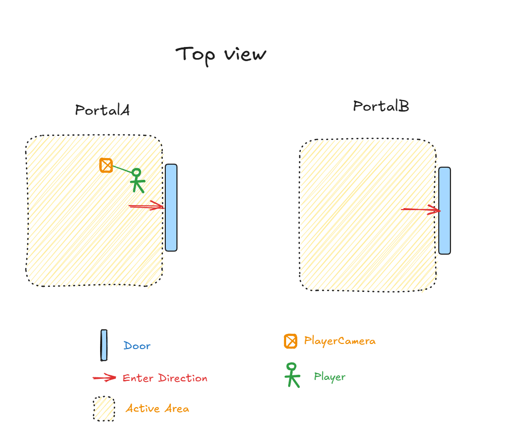
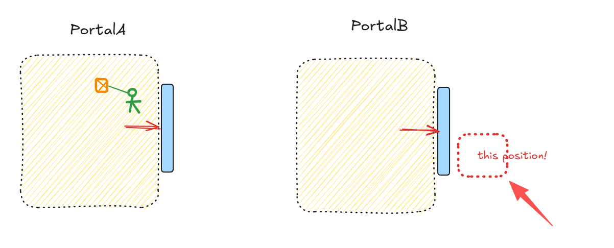
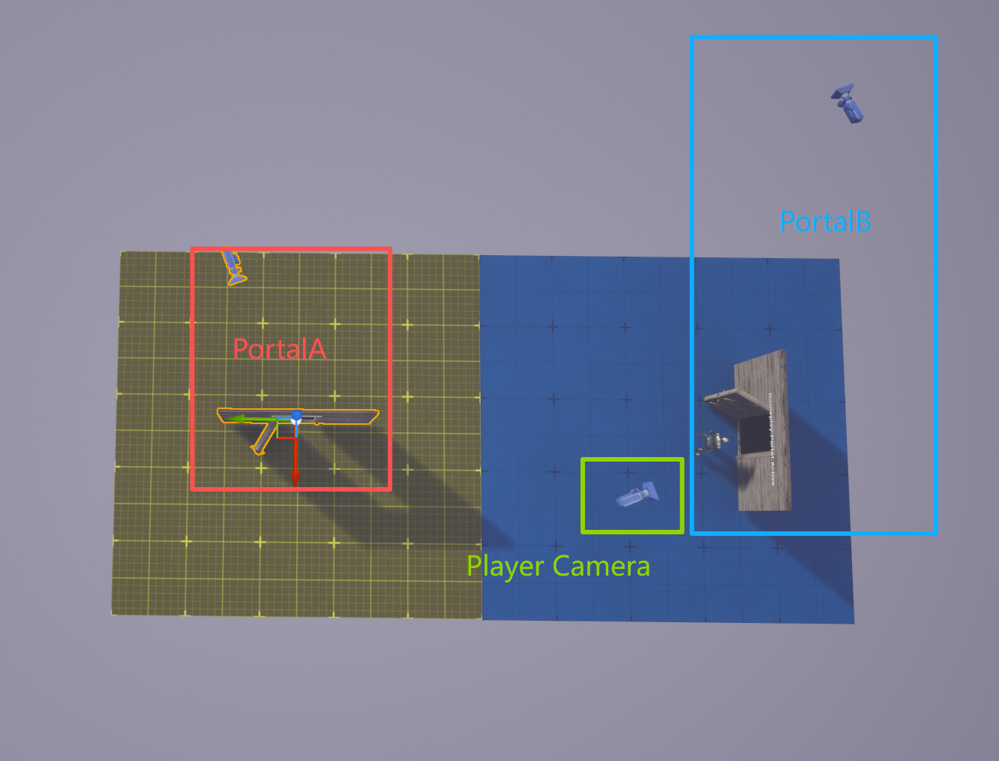
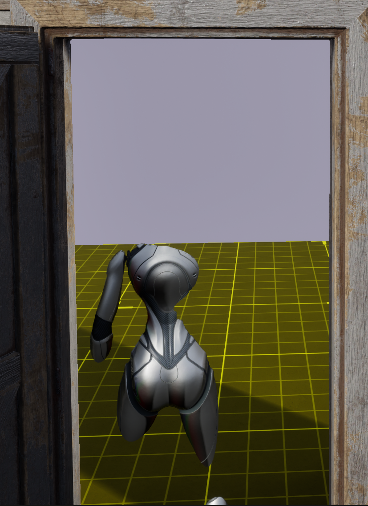
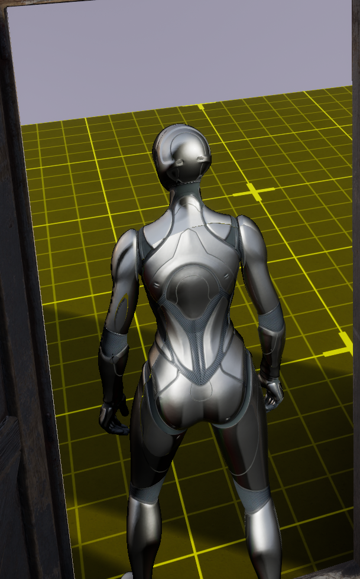

# 第三人称无缝传送门

**传送门**这一游戏机制早在十几年前就已得到了充分的开发和应用。然而，作为一种经典的**视觉诡计**，其独特的魅力在今天看来依然不过时。要实现一个平滑、自然的传送过程，需要考虑许多有趣的细节。在详细解释实现原理之前，我们先来看看最终的效果。


# 基本原理

在讨论一组传送门时，为方便描述，我们规定一个默认顺序：玩家总是从 A 门进入，并传送到 B 门。我们称 **A 门**为**触发传送门**，**B 门**为**关联传送门**。

为了实现上述视觉效果，我们将其分解为三个阶段进行解释。

## 图像捕捉

我们首先在传送门内部放置一个平面，并实时显示另一个传送门位置的图像，这需要利用 **RenderTarget** 的机制。

**RenderTarget** 是一块可供渲染的纹理，用于存储某个相机的渲染结果。在本例中，我们使用 **SceneCaptureComponent2D** 作为虚拟相机，将其拍摄的画面存储到 RenderTarget 中。材质随后可以将该 RenderTarget 作为普通纹理进行采样，从而实时显示捕捉到的画面。


- 未激活时，简单显示为白色，激活时，读取纹理。

**关键问题：虚拟相机的位置** 关键问题在于：该虚拟相机应该放置在何处，才能捕获到符合玩家**认知直觉**的图像？ 如图所示（这是一个俯视图），我们规定红色箭头为门的**正方向（ForwardVector）**。Portal A 和 B 是一组关联门。当玩家站在 A 门右侧并朝门内看去时，所看到的图像应由 B 门的虚拟相机提供，其内容应是 B 门**左侧的区域**。 *(这是符合直觉的：因为玩家通过 A 门传送到 B 门后，将出现在 B 门的左侧，面向 B 门的正方向，准备再次穿越。)*



**变换逻辑：**

玩家相机的世界坐标系相对于**触发门** A 的变换，经过一次镜像旋转（绕门 A 的上方向轴旋转 180 度）后，即为**关联门** B 的虚拟相机相对于门 B 的变换。*(虚拟相机的俯仰角 Pitch 和翻滚角 Roll 相较于玩家相机而言保持不变)*。



在编辑器下可能更加直观，值得注意的是，无论是门A还是门B，其遵守的规则都是一致的，我们可以看到蓝色的传送门B，它的虚拟相机处在一个“奇怪”的位置，但只要仔细思考，就会知道这是合理的。虽然我们没有仔细地讨论旋转关系，但虚拟摄像机地朝向依然遵循上述规则进行变换。 让我们再次重申这一变换：**对于任一传送门，其虚拟相机相对于该传送门的位置，等于玩家相机相对于其关联传送门的位置，再绕着关联传送门的上方向轴旋转 180 度所得到的相对位置。**



借助虚幻引擎的数学工具，我们可以很快写出这段代码。

```cpp
FTransform APortalDoor::CalculateMirroredRelativeTrans(const FTransform& InTransform, 
const FTransform& BaseTransform)
{
	// get relavatie transform
	FTransform LocalTrans = InTransform.GetRelativeTransform(BaseTransform);
	const FVector UpVector = BaseTransform.GetRotation().GetUpVector();
	
	// make rotation matrix, around upvector rotate 180'
	FQuat RotUp180Quat(UpVector, FMath::DegreesToRadians(180.0f));
	FTransform  FMirroredLocalTrans;
	FMirroredLocalTrans.SetLocation(RotUp180Quat.RotateVector(LocalTrans.GetLocation()));
	FMirroredLocalTrans.SetRotation(RotUp180Quat * LocalTrans.GetRotation());

	// now we get mirrored transform
	return FMirroredLocalTrans;
}
```

该函数的两个入参都为世界变换（World Transform）。`InTransform` 是我们期望进行 180 度旋转的对象（本例中传入 `CameraManager` 的变换），而 `BaseTransform` 则是参照基准变换（本例中传入**关联传送门**的变换）。函数的返回值是镜像后的**相对变换（Relative Transform）**，可以直接赋值给自身传送门的 `SceneCaptureComponent2D` 组件。

**`BaseTransform` 选取原因：**

A 门（触发门）所显示的图像，是由 B 门（关联门）处的虚拟相机捕获的。因此，对于 A 门来说，玩家相机进行镜像变换的基准就是关联门 B 的位置，得到的相对变换用于设置 A 门 `SceneCaptureComponent2D` 组件的位置。对 B 门来说，逻辑是同理的。

```cpp
// tick update 
void APortalDoor::Tick(float deltaTi)
{

	APortalDoor* LinkDoor = GetLinkPortal();
	APlayerCameraManager* CameraManager = UGameplayStatics::GetPlayerCameraManager(this,0);
	FTransform CameraTransform = CameraManager->GetTransform();
	FTransform  FMirroredLocalTrans = CalculateMirroredRelativeTrans(CameraTransform,LinkDoor->GetActorTransform());
	
	// PortalCamera is SceneCaptureComponent2D
	PortalCamera->SetRelativeTransform(FMirroredLocalTrans);
	
}
```

这种变换关系是该 Gameplay 设计中最核心的数学计算之一，我们将其命名为**镜像变换**。后续文章中，凡提及此名称，即表示进行了同样的数据计算，可能仅修改了输入参数的值。

## 相机处理

既然我们已经实现了能正确显示传送门后世界的机制，接下来是否应该解析传送过程中的秘密？不，在此之前，我们先假设传送机制已正确运行（详细解释将在下一节给出），首先讨论相机处理的细节。

**问题提出：**

思考一个问题：在第三人称游戏中，角色传送后，玩家相机将跟随角色一同传送，场景会瞬间发生变化。这种视角的突然跳转会**强烈地提醒**玩家角色位置发生了突变。如何消弭掉这样穿帮的镜头呢。我们采用的办法是进行两次 **ViewTarget** 的切换。

我们为传送门额外添加一个普通的 **CameraComponent**（与 `SceneCaptureComponent2D` 有别），下文称之为 **ViewCamera**。它将在玩家传送前后接管角色相机，向玩家展示画面。其行为模式如下：

| 切换阶段               | 行为描述                                                     |
| ---------------------- | ------------------------------------------------------------ |
| 第一次切换（进入前）   | 当角色正在穿越门但尚未发生传送时，`ViewCamera` 会完全模拟角色相机的位置和旋转。此时调用 `DetachViewTarget(true)`，`PlayerController` 从注视角色切换到**注视传送门**。 |
| 第二次切换前（传送后） | 当角色穿越门并发生传送后，`ViewCamera` 的位置会**镜像模拟**角色相机相对于关联传送门的相对位置（**第二次应用镜像变换**），营造出角色仍停留在门背后的错觉。 |
| 第二次切换（离开后）   | 当相机也穿过门后，调用 `DetachViewTarget(false)`，`PlayerController` 重新切换回**注视角色**。至此，整个传送过程宣告结束。 |

```cpp
// 更新 ViewCamera 变换，用于第二次切换前
void APortalDoor::UpdateViewCameraTransform()
{
	APortalDoor* LinkDoor = GetLinkPortal();
	if (!LinkDoor)
	{
		return;
	}
	
	ACharacter* Character = Cast<ARCharacter>(UGameplayStatics::GetPlayerCharacter(this,0));
	auto CharacterCam = Character ->GetCharacterCamera();
	FTransform PlayerCameraTrans = CharacterCam->GetComponentTransform();
	FTransform  FMirroredLocalTrans = CalculateMirroredRelativeTrans(PlayerCameraTrans,LinkDoor->GetActorTransform());

	ViewCamera->SetWorldTransform(FMirroredLocalTrans * GetActorTransform());
}

void APortalDoor::DetachViewTarget(const bool bDetach)
{
	APlayerController* PlayerController = UGameplayStatics::GetPlayerController(this,0);
	if (bDetach)
	{
		PlayerController->SetViewTargetWithBlend(this,0);
	}else
	{

		ACharacter* Character =UGameplayStatics::GetPlayerCharacter(this,0);
		PlayerController->SetViewTargetWithBlend(Character,0);
	}
}
```

**防止穿帮的射线检测**

为了避免在相机分离期间，玩家旋转视角到门后发现场景空无一物，我们在此过程中还会持续进行**射线检测**：从角色相机向角色发射射线，一旦射线没有撞击到传送门（即认为角色已移动到门后），同样会立即结束相机分离的状态。

## 传送处理

当角色穿过传送门时，需要将其传送到关联门后对应的位置。目标位置的计算依然沿用上述**镜像变换**。只需将 `CalculateMirroredRelativeTrans` 函数中的 `InTransform` 替换为**角色自身**的变换，而 `BaseTransform` 替换为**触发传送门**的变换。

```cpp
void APortalDoor::TeleportCharacter(ACharacter* Character)
{
		FTransform CharacterTransform = Character->GetActorTransform();
		FTransform  FMirroredLocalTrans = CalculateMirroredRelativeTrans(CharacterTransform,GetActorTransform());
		FTransform FinalTransform = FMirroredLocalTrans * GetLinkPortal()->GetTransform();
		
		Character->SetActorLocation(FinalTransform.GetLocation());
		Character->SetActorRotation(FinalTransform.Rotator());
}
```

还没完！为保持传送后的**连贯性**，在传送角色后，我们还需要重新设置角色的**速度向量**和 **PlayerController** 的方向。

### 速度方向处理

对于速度向量，其相对于角色自身方向向量的**空间姿态关系**在传送前后应当保持不变。换言之，这两个向量的夹角、相对方向和比例关系不应因传送而改变。

假设：

- $R_{old}$ ：角色传送前的旋转矩阵
- $R_{new}$：角色传送后的旋转矩阵
- $V_{old}$：传送前的速度向量
- $V_{new}$：希望传送后得到的新速度向量

目标是保持相对方向一致，即：
$$
V_{new} = R_{new}*R^{-1}_{old} * V_{old}
$$


在虚幻引擎中，我们借助`UnrotateVector` 和`RotateVector` 这对数学工具来描述。

- `RotateVector(v)` : $R*v$
- `UnrotateVector(v)` : $R^{-1}*v$

| 函数                | 功能                             | 含义     |
| ------------------- | -------------------------------- | -------- |
| `RotateVector(v)`   | 将向量从局部空间旋转到世界空间   | 应用旋转 |
| `UnrotateVector(v)` | 将向量从世界空间逆旋转回局部空间 | 去除旋转 |

两者互为逆操作。基于此，我们可以很快写出以下代码：

```cpp
FVector OldCharacterDir =  Character->GetActorForwardVector();
FRotator OldVelocity = Character->GetVelocity().Rotation();

// after Teleport...
FVector NewCharacterDir = Character->GetActorForwardVector();

FVector LocalVelocityVec = OldVelocityDir.UnrotateVector(OldCharacterDir);
FVector NewVelocity = (LocalVelocityVec.Rotation()).RotateVector(NewCharacterDir);

// set new direction
Character->GetCharacterMovement()->Velocity = FinalVelocityDir;
```

### `PlayerController` 处理

对于`PlayerController` ，则需要注意更多细节。

发生传送时，角色的旋转已被修改。如果不同步修改 `PlayerController` 的旋转，玩家可能会从传送前看着角色的背面，变为传送后看着角色的侧面。此外，`PlayerController` 的旋转也会影响玩家相机的位置。 解决思路很简单，与速度向量的处理思路一致：我们只需要保证 `PlayerController` 的方向与角色方向在传送前后的**相对关系保持一致**。唯一的细微差别在于，我们**只修改** `PlayerController` 的 **Yaw** 分量。

```cpp
FVector OldCharacterDir =  Character->GetActorForwardVector();
FRotator ControllerRot =  PlayerController->GetControlRotation();

// after Teleport...
FVector NewCharacterDir = Character->GetActorForwardVector();

	FVector LocalControllerVec  =  ControllerRot.UnrotateVector(OldCharacterDir);
FVector FinalControlDir = (LocalControllerVec.Rotation()).RotateVector(NewCharacterDir);
ControllerRot.Yaw = FinalControlDir.Rotation().Yaw;

// set new direction
PlayerController->SetControlRotation(ControllerRot);
```

**解决控制错位**

另一个关于PlayerController的重要问题是： 由于 `PlayerController` 的旋转已被修改，但玩家实际观察世界的方向并未改变，这会导致它的方向与玩家注视视角的方向不匹配。由此带来的问题是，当玩家透过门观察并试图操控角色向前移动时，实际角色可能会向侧方移动。 解决该问题只需在角色的控制输入函数中，让角色的移动方向**始终以 PlayerController 的方向为准**，从而消除这种控制与移动不匹配的**错位感**，使最终呈现的效果完美符合玩家的操作直觉。

```cpp
void YourCharacter::Input_Move(const FInputActionValue& InputValue)
{
	if (!Controller) { return; }
	
	const FVector2D Value = InputValue.Get<FVector2D>();
	const FRotator Rotation = Controller->GetControlRotation();
	
	// error!!!
	// APlayerCameraManager* CameraManager = UGameplayStatics::GetPlayerCameraManager(this,0);
	// FRotator Rotation = CameraManager->GetCameraRotation();
	
	const FRotator YawRotation(0.0f, Rotation.Yaw, 0.0f);
	
	if (Value.X != 0.0f)
	{
		const FVector Direction = YawRotation.RotateVector(FVector::RightVector);
		AddMovementInput(Direction, Value.X);
	}

	if (Value.Y != 0.0f)
	{
		const FVector Direction = YawRotation.RotateVector(FVector::ForwardVector);
		AddMovementInput(Direction, Value.Y);
	}
}
```

这是一个非常典型的移动函数，而输入组件使用的是虚幻引擎的EnhanceInputComponent，如果你对此感兴趣，可以自行检索相关的文章，但这并不在本文的讨论范围内。这段代码的表达的逻辑非常简单：接受输入，并转换成方向向量驱动移动组件。 我们必须确保使用的 `YawRotation` **以 Controller 的方向为准**，而非注释代码中的 `CameraManager`。尽管在正常的第三人称视角下二者可能没有差别，但在我们这种特殊的传送场景下，使用 `CameraManager` 会导致控制与移动不匹配的问题。

终于！一旦我们把这些数学关系都完全处理正确，就可以得到一个十分流畅自然的第三视角传送门了，除最后一个的细节。

## 细节处理

**镜像角色**

当角色只穿过传送门一半时，会造成角色模型被门一分为二的视觉效果



示例中采用了一个**简易而巧秒**的方法：在角色穿过 A 门但尚未触发传送的过程中，我们在 B 门（关联门）处生成一个一模一样的**镜像角色**。该镜像角色会完全模仿玩家主控角色的动画，并进行**镜像变换**，以模拟角色在 A 门的行动，从而与 B 门投射的图像完美匹配。

```cpp
	APortalDoor* LinkDoor = GetLinkPortal();
	auto* Character = UGameplayStatics::GetPlayerCharacter(this,0);
	FTransform CharacterTransform = Character->GetActorTransform();
	FTransform  FMirroredLocalTrans = CalculateMirroredRelativeTrans(CharacterTransform,LinkDoor->GetActorTransform());
	MirrorCharacter->SetActorTransform(FMirroredLocalTrans * GetActorTransform());
```

而创建一个模拟角色行动的Character也非常容易实现，虚幻引擎提供了一个动画蓝图节点CopyPoseFromMesh。如下图所示：


这里CharacterReference是玩家操控角色的MeshComponent。我们会在接触到传送区域尚未传送前，才把镜像角色在关联门显示出来，有时候会因为第一帧尚未准备好骨骼姿态数据导致TPose，我们还需要手动更新一下。

```cpp
MirrorCharacter->GetMesh()->RefreshBoneTransforms();
MirrorCharacter->SetActorHiddenInGame(false);
```

做完这一切的效果如下图所示，关联门投射过来的图像正好和正在穿过门的玩家主控角色完美契合，严丝合缝。虽然仔细观察还是能看到被门切过产生接缝的地方，但细节已经足够好到能欺骗玩家的眼睛了。



# 工程实现

上一章已将整个视觉诡计的构成原理全部解析完毕，技术上已无更多秘密。本节将对示例工程的实现进行解释。项目实现虽有优劣之分，但并无唯一正确的答案。此示例工程是为了更好地展示 Gameplay 的全貌，它跳过了许多试错和修改过程，最终呈现出符合个人设计和代码组织习惯的结果。

因此，我也非常鼓励你参考上一章节的原理，以自己喜欢的方式重现这一Gameplay，这无疑是深刻理解该玩法的最佳尝试！

## 流程设计

传送门的Actor如下图所示，用GameplayTag来标识传送门，并以此找到匹配的关联门。

- `ActiveDetectionBox`：用来检测角色是否进入/离开传送门区域，激活/关闭传送门并并进行一系列行为
- `CrossingDetectionBox`：用来检测角色是否进行/结束穿越行为，在离开碰撞区域时，传送角色
- `ViewCamera`：一个CameraComponent，当相机分离时，接管并显示玩家看到的画面。
- `PortalCamera`: CaptureSceneComponent2D，用来捕获并传输给关联门图像
- `Plane`：由PortalCamera捕获的纹理会在显示在该mesh材质上


**为什么要设计两个 TriggerBox？**

这样设计的好处在于，我们可以通过 `Overlap` 事件的**触发顺序**，直接区分玩家进入传送门的方向：

- **正确方向进入：** 玩家先碰撞 `ActiveDetectionBox`，后碰撞 `CrossingDetectionBox`。当玩家离开 `CrossingDetectionBox` 区域时，执行传送行为。
- **错误方向进入：** 玩家先碰撞 `CrossingDetectionBox`，后碰撞 `ActiveDetectionBox`。此时认为玩家进入了错误的方向，不执行传送。

结合接下来要叙述的**状态机架构**，这种设计能省去大量复杂的条件判断逻辑。

## 状态机架构

状态机是处理 Gameplay 流程的一种常见方案。虽然例程中的状态情况并没有多到一团乱麻的情况，然而借助状态机模式，依然能够很好地**降低心智负担**。对于此Gameplay来说，并不需要设计过于复杂的状态机架构。 我们将整个传送过程划分为大致三个阶段，门的**状态**总计有六个，均以 `GameplayTag` 进行标识，并由挂载在 Portal 上的 `StateMachineComponent` 进行管理。

| **状态名称**              | **归属对象** | **触发条件**                    | **主要逻辑**                                                 |
| ------------------------- | ------------ | ------------------------------- | ------------------------------------------------------------ |
| `Portal.UnActive`         | 门           | 默认/离开                       | 门处于未激活状态，只显示发光图像。                           |
| `Portal.Active`           | **触发门**   | 角色进入 `ActiveDetectionBox`   | 更新 `PortalCamera` 变换，捕捉图像给关联门。                 |
| `Portal.LinkActive`       | **关联门**   | 角色进入 `ActiveDetectionBox`   | 更新 `PortalCamera` 变换，捕捉图像给触发门。                 |
| `Portal.Crossing`         | **触发门**   | 角色进入 `CrossingDetectionBox` | 触发相机分离（第一次切换），开始更新 `ViewCamera`（模拟玩家相机）。 |
| `Portal.LinkCrossing`     | **关联门**   | 角色进入 `CrossingDetectionBox` | **生成镜像模仿的角色**，模拟角色运动。                       |
| `Portal.PostCrossing`     | **触发门**   | 角色离开 `CrossingDetectionBox` | `ViewCamera` 进行镜像变换更新（第二次切换前）。              |
| `Portal.LinkPostCrossing` | **关联门**   | 角色离开 `CrossingDetectionBox` | 隐藏镜像角色，进行射线检测，准备更改 `ViewTarget`（第二次切换）。 |

基本上，这些状态是两两一组对应的，而每个状态自身的逻辑需要关注的逻辑都非常简洁。

`StateMachineComponent` 的实现相对简单，它以 **DataTable** 的形式存储了状态的转换规则，并提供了一个统一的接口 `TryChangeState` 进行状态切换。此外，它还提供了三个关键的入口函数，由各个 State 实例重写，以实现各自状态的逻辑：

- `OnStateEntered` 状态进入时
- `OnStateExited` 状态离开时
- `Update` 进行Tick更新

```cpp
bool UStateMachineComponent::TryChangeState(const FGameplayTag NewStateTag)
{
	// ...
	// check can transition
	
	UStateBase* NextState = AllStates[NewStateTag];
	// Exits Old State
	FGameplayTag PreviousStateTag;
	PreviousStateTag = CurrentState->GetStateTag();
	CurrentState->OnStateExited_Implementation(NewStateTag);
    
	// Enter New State
	CurrentState = NextState;
	CurrentState->OnStateEntered_Implementation(PreviousStateTag);
	
	// ...
}
```

而状态之间能够进行切换的关系如图所示


## 另一些设置

**碰撞调整**

在相机分离后进行摄像机旋转时，我们需要关掉玩家相机`SpringArm`的碰撞调整，以免因为意外的碰撞使得相机的位置发生跳变，从而导致触发门这一侧的玩家观察位置发生跳变，这个调整也非常简单，我们选择写在`LinlPostCrossingState`的逻辑内。

```cpp
void UPortalLinkPostCrossingState::OnStateEntered_Implementation(const FGameplayTag& FromState)
{
	Super::OnStateEntered_Implementation(FromState);

	APortalCharacter* PCharacter = Cast<APortalCharacter>(UGameplayStatics::GetPlayerCharacter(this,0));
	check(PCharacter);
	if (USpringArmComponent* SpringArm = PCharacter->GetCameraBoom())
	{
		SpringArm->bDoCollisionTest = false;
	}
	
}

void UPortalLinkPostCrossingState::OnStateExited_Implementation(const FGameplayTag& ToState)
{
	Super::OnStateExited_Implementation(ToState);
	APortalCharacter* PCharacter = Cast<APortalCharacter>(UGameplayStatics::GetPlayerCharacter(this,0));
	check(PCharacter);
	if (USpringArmComponent* SpringArm = PCharacter->GetCameraBoom())
	{
		SpringArm->bDoCollisionTest = true;
	}
}
```

**抗锯齿**

我们修改了项目抗锯齿设定，改用了FXAA，这样能让传送门内的图像变得更加自然


**镜像角色**

对于用来复制姿势的镜像角色，我们会在其穿越前进行显示，可能存在显示时，由于可见性设置的原因，骨骼姿势尚未更新而导致在第一帧出现错误姿势，尤其是其第一次显示时最为明显（因为初始姿势是T Pose），为了解决这穿帮的一帧，可以做以下设置：


更改优化设置，把`VisibilityBaseAnimTickOption` 改成`AlwaysTickPoseAndRefreshBones`  这项设置会使得即使在隐藏状态，网格体依然会更新骨骼位置。

不过这对性能显然不够友好，因此示例工程使用的方法则是在显示前，手动更新一帧。

```cpp
	PortalDoor->MirrorCharacter->GetMesh()->GetAnimInstance()->UpdateAnimation(0,true);
	PortalDoor->MirrorCharacter->GetMesh()->RefreshBoneTransforms();
	PortalDoor->MirrorCharacter->SetActorHiddenInGame(false);
```

值得一提的是，示例并没有对性能优化做过多的工作，因此会存在帧数明显下降的情况。

至此，没有更多可供说明的部分。再次声明一遍，这是跳过了许多思考步骤和尝试，而最终呈现的结果。实际上，我们还可以再次基础上扩展更多有趣的视觉体验，就像是《Portal》曾经做过的一样，但总而言之，对于目前的复杂度而言，这篇文档已经足够长了。

# 链接

Github：

Epic：

# 参考

需要声明的是，本文的绝大部分思路都已经有其他人总结并实现过，当然这并不妨碍我们再次尝试和制作诸如此类的 Gameplay，毕竟这也是乐趣的一环。

https://www.froyok.fr/blog/2019-03-creating-seamless-portals-in-unreal-engine-4/

https://www.youtube.com/watch?v=6BT-Ux56KBs

https://thegabmeister.com/blog/portals-level-streaming/